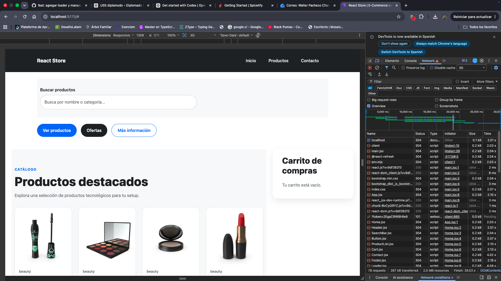

# React Store

React Store es una aplicación desarrollada con **React + Vite** que simula un e-commerce moderno. La aplicación consume productos desde la API pública **DummyJSON**, permitiendo visualizar un catálogo dinámico, buscar productos y gestionar un carrito de compras.

---

## Tecnologías utilizadas

- React
- Vite
- JavaScript ES6+
- Bootstrap 5
- CSS3
- Fetch API
- Git y GitHub

---

## API utilizada

Los productos se obtienen desde la API pública DummyJSON:

https://dummyjson.com/products

La aplicación implementa:

- Consumo de API mediante **fetch**.
- Manejo de **loading**.
- Manejo de **errores**.
- Renderizado dinámico de productos.

---

## Características

- Catálogo dinámico de productos.
- Búsqueda por nombre o categoría.
- Carrito de compras.
- Formulario de contacto con validaciones.
- Componentes reutilizables.
- Diseño responsive.
- Manejo de estados con React Hooks.

---

## Componentes desarrollados

- Header
- SearchBar
- Button
- ProductCard
- ProductList
- Cart
- Contact
- Loader
- ErrorMessage
- Footer

---

## Estructura del proyecto

```text
src/
├── components/
│   ├── Header/
│   ├── SearchBar/
│   ├── Button/
│   ├── ProductCard/
│   ├── ProductList/
│   ├── Cart/
│   ├── Contact/
│   ├── Loader/
│   ├── ErrorMessage/
│   └── Footer/
├── pages/
│   └── Home.jsx
├── App.jsx
├── main.jsx
└── index.css
```

---

## Funcionalidades implementadas

- Componentes reutilizables.
- Props.
- useState.
- useEffect.
- Fetch API.
- Renderizado condicional.
- Renderizado mediante map().
- Manejo de eventos.
- Filtro dinámico de productos.
- Carrito de compras.
- Formularios controlados.
- Validación de formularios.
- Organización modular del proyecto.

---

## Instalación

Clonar el repositorio:

```bash
git clone https://github.com/walterpacheco/react-store.git
```

Ingresar al proyecto:

```bash
cd react-store
```

Instalar dependencias:

```bash
npm install
```

Ejecutar la aplicación:

```bash
npm run dev
```

---

## Capturas de pantalla

### Vista general


### Búsqueda de productos


### Estado de carga



---

## Autor

Walter Pacheco

---

## Estado del proyecto

Proyecto desarrollado con fines académicos para el Diplomado Full Stack, aplicando buenas prácticas de React, organización por componentes y consumo de APIs.
## Capturas de pantalla

### Vista principal


### Búsqueda de productos


### Loading

